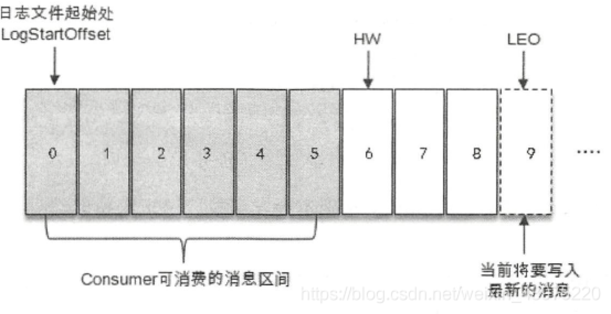
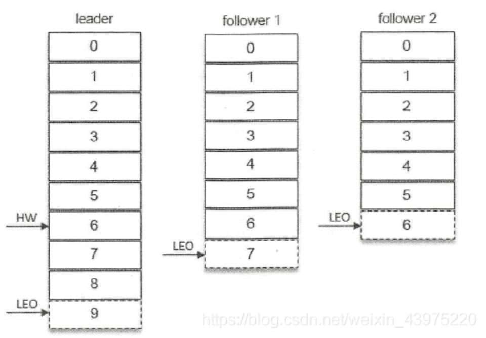

# Kafka中Follower如何与Leader同步数据

1. 参考链接
    - https://blog.csdn.net/weixin_43975220/article/details/93190906
    - https://blog.csdn.net/lizhitao/article/details/45066437

2. 名词解释
    - 
    - logEndOffset(LEO)
        - LEO - 1 表示 log 中最后的 message 的 offset 位置，插入消息的 offset 为 LEO。
    - LastStableOffset(LSO)
        - 待补充...
    - high watermark(HW)
        - 高水位，表示 partition 中各个副本 replicas 数据间同步且一致的 offset 位置，即 all replicas 已经 commit 的位置，
        每个 brok 缓存中维护此信息，并不断更新。
        - 消费者只能拉取到 HW 之前的消息。
    - low watermark(LW)
        低水位，LW是Low Watermark的缩写，俗称“低水位”，代表AR集合中最小的logStartOffset值，副本的拉取请求（FetchRequest，
        它有可能触发新建日志分段而旧的的被清理，进而导致logStartoffset的增加）和删除请求（DeleteRecordRequest）都可能促使LW的增长。
3. Kafka中replication复制数据
    - partition 与 replica 关系
        - kafka 一个 topic 可以有多个 partition，一个 partition 可以有多个副本，分为 leader副本和 follower副本，
        - 其中只有leader副本负责读写，follower副本只负责同步leader副本的数据。
        - 分区中的所有副本统称为AR（Assigned Repllicas）， AR = ISR（In-Sync Replicas） + OSR （Out-Sync Replicas）。
          ISR 是 AR 的一个子集，包含 leader副本、一定程度内落后于 leader副本的 follower副本。
    - 数据可靠性保证
        为保证生产者发送的数据能可靠地发送到指定的 topic，topic 中每一个 partition 收到消息后都需要向生产者发送 ACK，当生产者收到 ACK 后，
        才会进行下一轮的发送，否则重新发送数据。
    - partition 何时发送 ACK
        每一个 partition 都会维护一个 ISR（in-sync replicas），只有 ISR 中所有的 follower 副本同步完 leader 
    - ISR
        - Follower副本用一个 ReplicaFetcherThread 线程，批量拉取 leader副本的数据。
        - ISR的伸缩
            - isr-expiration 脚本，会周期性地检查每个分区是否需要缩减 ISR 集合。这个周期与 replica.lag.time.max.ms 参数有关，默认为 5000ms。
            - 当 ISR 集合发生变更时，
                1. 会将变更后的数据记录到ZK对应/brokers/topics//partition//state节点中，数据结构如下：
                {"controller_cpoch":26,"leader":0,"version":1,"leader_epoch":2,"isr":{0,1}}
                其中controller_epoch表示的是当前的kafka控制器epoch.leader表示当前分区的leader副本所在的broker的id编号，version表示版本号，
                （当前半本固定位1），leader_epoch表示当前分区的leader纪元，isr表示变更后的isr列表。
                2. 当ISR集合发生变更的时候还会将变更后的记录缓存到isrChangeSet中。
                3. （无论 ISR 缩减还是扩充）isr-change-propagation任务会周期性（固定值为2500ms）地检查isrChangeSet，若 isrChangeSet 有变更记录，将会同步到ZK，
                Zookeeper的/isr_change_notification的路径下创建一个以isr_change开头的持久顺序节点（比如/isr_change_notification/isr_change_0000000000), 
                并将isrChangeSet中的信息保存到这个节点中。
                4. kafka控制器为/isr_change_notification 添加了一个Watcher，当这个节点中有子节点发生变化的时候会触发Watcher动作，
                以此通知控制器更新相关的元数据信息并向它管理的broker节点发送更新元数据信息的请求。最后删除/isr_change_notification的路径下已经处理过的节点。
                5. 当 （上一次 ISR 集合发生变更距离现在已经超过 5s || 上一次写入 ZK 距离现在已经超过 60s ） 时， isr-change-propagation任务才会将变更写入到目标节点（应该是 /isr_change_notification/isr_change_0000000000）。 
            - ISR 的扩充
                1. 当 OSR 中的 follower副本的 LEO >= leader副本的 HW，才有资格进入 ISR。
            - 当ISR集合发生增减时，或者ISR集合中任一副本LEO发生变化时，都会影响整个分区的HW。
            - 