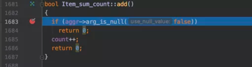
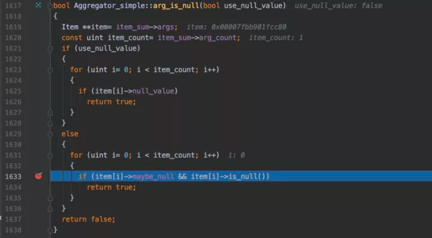

# count(*) & count(1) & count(主键) & count(非主键列)
## 参考链接
https://mp.weixin.qq.com/s?__biz=MzIxNTQ3NDMzMw==&mid=2247486071&idx=1&sn=7160fc85721f27177d7aeabfe92aa991&chksm=97968385a0e10a93432d02b9a9535176ea437d4689cab54412fb6ec0a8c5d1a0c9fdd3d47496&scene=21#wechat_redirect

1. count(*)/count(1)/count(主键) server层会根据合适的索引来统计表的行数。
2. count(非主键列) server 只能用包含这个列的索引去执行，有可能并不能用最小索引来执行语句。
3. count(expr) 中的 expr 是表达式，会根据 (expr != null) 的值有多少。
4. count(*) 中的 * 会被转成 0 来处理, 即 count(*) == count(0), 所以1 和 0 都不是null, 就是将全表数据统计出来。
5. count(主键) 中的主键列不可能是null，所以也会将全表统计出来
6. count(非主键列) 中可能存在null，所以只会将非null的行数统计出来。

7. +1的代码

item[i] 标识 count(expr) 中的expr参数

