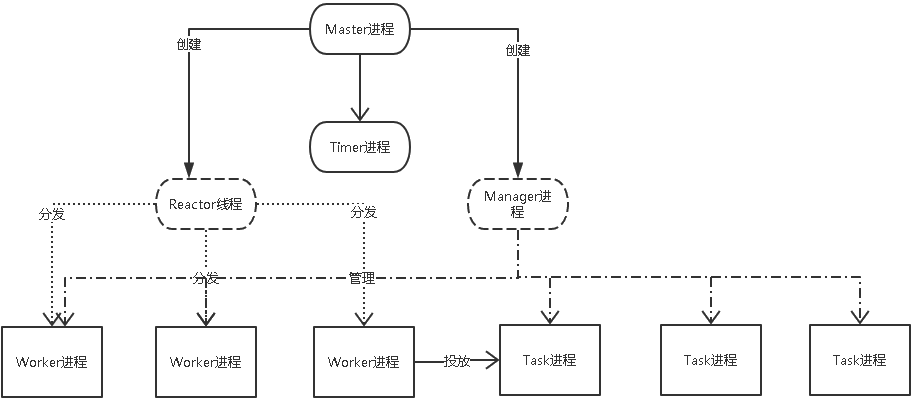

#Swoole进程模型

##参考链接
https://www.cnblogs.com/wanghanlin/p/11425262.html

1. Master 进程主要是做监听socket，分配socket给 Reactor线程。
   1. master进程会根据每一个 Reactor 线程处理的线程数，来决定分配 socket，不仅有负载均衡的作用，也解决了epoll模型的惊群效应。
   2. master进程包括master线程和Reactor线程，还有心跳检测线程，UDP收包线程。
   3. master进程通过select/poll模型来处理socket。
2. Reactor 线程是用epoll模型来监听master分配的socket的事件。
   1. Reactor 线程负责处理TCP连接，网络IO，收发数据。
   2. 收到socket后，会分给worker进程来处理。
3. Manager进程
   1. 分为worker进程和task进程。
   2. Manager进程会fork出指定数量的worker进程和task进程，负责管理worker进程和task进程。
   3. 类似于PHP-FPM形式。
4. Worker进程
   1. 负责实际的用户请求处理。
   2. 采用同步阻塞方式。
5. Task进程
   1. 负责处理一些异步任务。
   2. 同步阻塞方式。
   3. worker进程以swoole_server->task调用，将任务投递给task进程，处理完后会回调worker进程。
