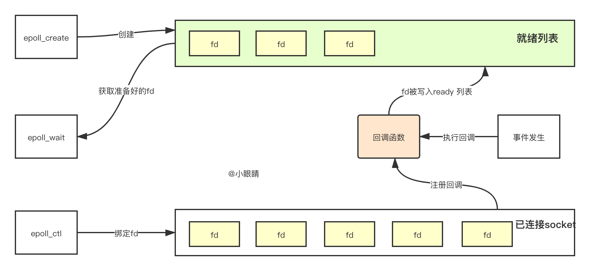

#epoll, poll, select
- 相关url
  1. https://segmentfault.com/a/1190000003063859
  Linux IO模式及 select、poll、epoll详解
  2. https://blog.csdn.net/m0_48071146/article/details/106319454
  读懂才会用 ： 瞅瞅Redis的epoll模型
  
- select 模型
    1. select() 函数
    ```int select (int n, fd_set *readfds, fd_set *writefds, fd_set *exceptfds, struct timeval *timeout);```
    
    2. 工作原理
    
    
    3. select 监听描述符分为readfds、writefds、exceptfds,当有描述符就绪或超时，就会返回。
    4. select需要遍历这三个描述符集合，找到就绪fd，当fd太多时性能就会下降。
    5. select最大监听fd数量为 1024，由posix_types.h头文件中声明：#define __FD_SETSIZE    1024
    
- poll模型
    1. poll函数
    ```C
    int poll (struct pollfd *fds, unsigned int nfds, int timeout);
    struct pollfd {
      int fd; /* file descriptor */
      short events; /* requested events to watch */
      short revents; /* returned events witnessed */
    };
    ```
    2. 与select模型比较，poll用了 pollfd 指针，没有最大监听数量的限制。
    3. select和poll都需要通过遍历fd找到已就绪的socket。
    4. 事实上，同时连接的大量客户端，在同一时刻可能只有很少就绪状态的，因此随着监视的fd数量增多，效率也会逐渐变低。
    
- event poll (epoll)
    1. epoll三个重要函数
    ```C
     int epoll_create(int size)；//创建一个epoll的句柄，size用来告诉内核这个监听的数目一共有多大
     int epoll_ctl(int epfd, int op, int fd, struct epoll_event *event)；
     int epoll_wait(int epfd, struct epoll_event * events, int maxevents, int timeout);
    ```
    2. （在线代码)https://elixir.bootlin.com/linux/v4.19.76/source/fs/eventpoll.c
    3. epoll_create函数
        1. 创建一个epoll文件描述符
        2. 创建eventPoll,其中包括高速缓存（红黑树）、待读取列表（双向链表）
    4. epoll_ctl函数
        1. 对指定fd执行op的绑定操作（监听哪个fd进行哪个OP操作）。
        2. op操作类型，用三个宏EPOLL_CTL_ADD，EPOLL_CTL_DEL，EPOLL_CTL_MOD，来分别表示增删改对fd的监听。
        3. 把fd写入红黑树中，并在内核注册回调函数
    5. epoll_wait函数
        1. 核心功能：获取epfd上的I/O操作
        2. events就是就绪事件，用来获得想要得到的事件集合
        3. epoll_wait函数会阻塞，直到一个fd触发了事件，或者被信号处理函数打断，获取超时。返回值是需要处理的fd的数量。
        
    6. 执行流程
    
    
    7. 优点
        1. epoll创建的红黑树保存所有fd，没有大小限制，且增删查的复杂度O(logN)    
        2. 基于callback，利用系统内核触发感兴趣的事件
        3. 就绪列表为双线链表时间复杂度O(1)
        4. 应用获取到的fd都是真实发生IO的fd，与select 和 poll 需要不断轮询判断是否可用相比，能避免无用的内存拷贝
    