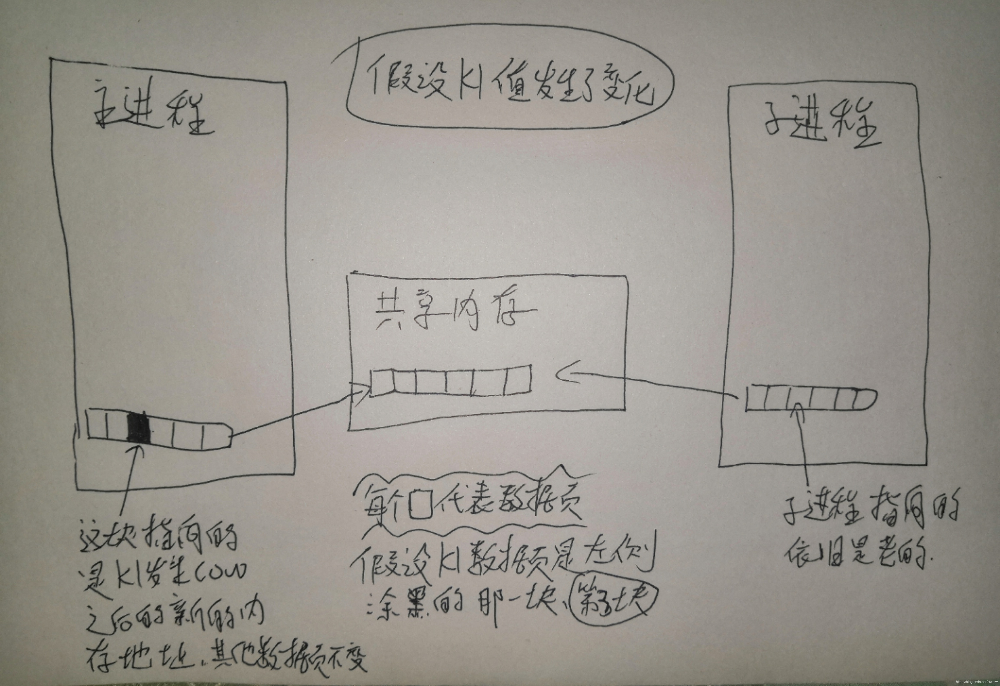
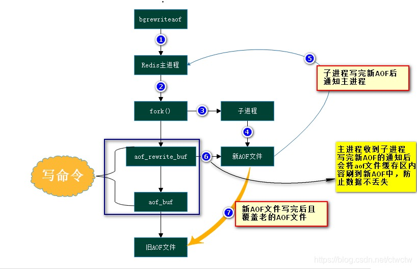

#Redis持久化

##链接
    https://www.cnblogs.com/GrimMjx/p/10695512.html

###RDB
1. 手动备份 SAVE。会用主进程做备份，直接导致服务不可用.
2. 自动备份 BGSAVE。
    1. 会fork子进程生成RDB文件
    2. fork() 系统调用 用到 copy on write技术。fork 出来的子进程一开始是共享父进程的内存空间的，内核会将父进程所有的内存页设为 read-only 权限。
       当父进程处理客户端的写请求时，会发生页中断，将发生页中断的那部分内存页复制出来，将更改写到新的内存页中，这一个内存页对子进程是不可见的。
    3. 优势：RDB是二进制文件，体积小，恢复快；不影响主进程处理客户端请求的响应时间；
    4. 缺点：RDB生成规则的配置没有AOF灵活，save xxx秒 xxx次key变更 才做一次备份，备份与备份之间宕机，会存在数据丢失的情况

###AOF
1. 主进程处理完客户端请求后，会将命令写到aof缓冲区，根据规则进行刷盘(always, everysec, no)，写到aof文件上。
2. 如果需要重新aof文件，主进程会fork子进程，重写aof文件
    1. redis 4.0前，只是将文件中冗余的命令删掉，比如 del key1/ set key1 重复数遍的，会过滤成一个最终结果。
    2. redis 4.0及之后，子进程会将共享内存中的快照，以RDB格式重写到aof文件，接着会将重写期间aof_rewrite缓冲区的命令追加到aof文件。
3. 主进程在重写aof文件期间，会将命令保存在aof缓冲区，以及aof_rewrite缓冲区，两份。子进程在重写完aof文件后，会将aof_write缓冲区的命令追加到新aof文件中
4. 如果开启了AOF，redis重启会优先加载AOF文件
