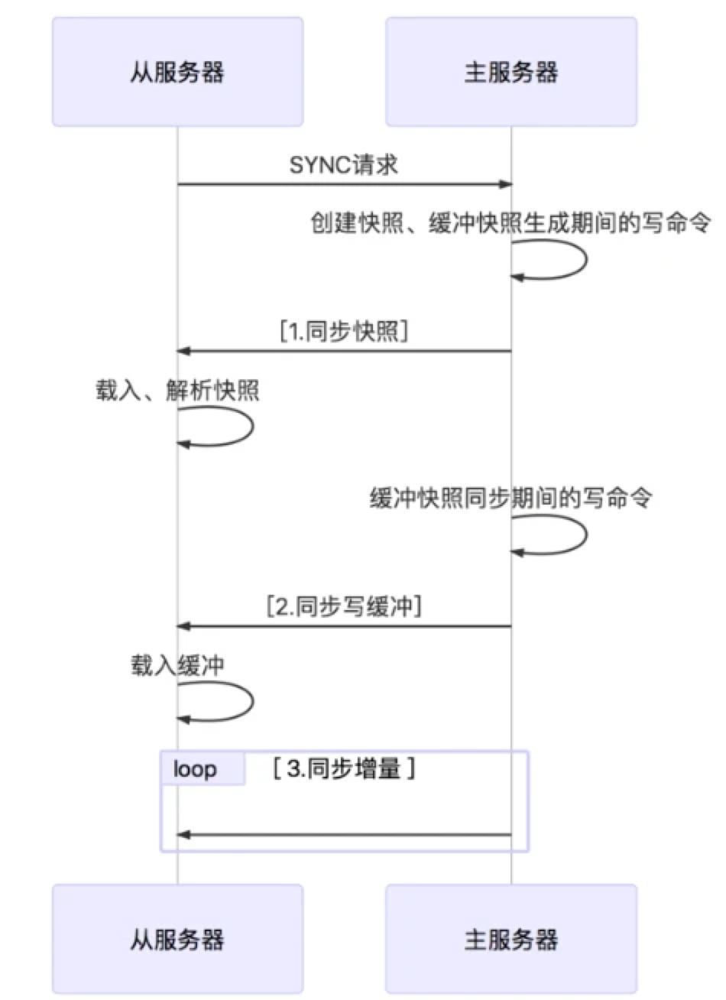

#Redis集群

##参考连接
1.https://segmentfault.com/a/1190000022808576
2.https://www.cnblogs.com/GrimMjx/p/10695512.html

###主从复制
1. 从库重启后，会发送SYNC命令给主库
2. 主库接收到SYNC命令后，会执行BGSAVE，生成RDB快照，并将陆续的请求写入缓冲区
3. RDB快照生成完后，会向从库发送RDB快照
4. 从库收到RDB快照之后，会丢弃现有数据，并用RDB快照恢复数据。
5. 主库发完RDB快照后，会将缓冲区的命令发送给从库（类似于binLog形式）
6. 主库之后就会每执行一次写命令，就同步一次给从库。

###哨兵模式
1. 哨兵集群监控redis集群。
2. 某哨兵检测到某主库异常后，会对这个节点进行主观下线，随后向其他哨兵（gossip 协议）询问该节点情况，获取到一半以上哨兵的下线返回，就达成客观下线。
3. 所有哨兵都有机会成为那个leader，操作客观下线的节点，就是在询问其他哨兵时，申请这个leader权限，获取到一半以上的赞同就成为leader，一个哨兵只能认同一个leader，先到先得。
4. 如果投票结果没有leader，会一段时间后再发起客观下线操作，重复选举。
5. leader哨兵进行完客观下线操作后，会通过 sub/pub 广播给其他从节点，开始同步最新主节点的配置和数据。

###Cluster模式
1. 槽位数量 16384
2. 为什么是16384，CRC16 产生的hash值有16bit，理论上槽位可以达到2的16次方 65535个。但是一个节点所负责的槽位越多，每一次ping的携带信息量越大，
    ping 的报文头中有携带槽位信息的字段，**如果槽位越多消息体越大**。**槽位越小，节点少的情况下，压缩率高**。
    **作者认为redis集群节点不建议超过1000个**， 所以16384就能满足 1000 个节点所需的槽位。
3. 扩容/缩容 -> 槽位迁移
    1. 通知目标节点准备导入数据
    2. 通知源节点准备迁移数据
    3. 获取槽位上n个数据
    4. pipeline 批量迁移n个数据到目标节点上
    5. 更改槽位负责信息
4. MOVED & ASK
    MOVED: 如果客户端请求到目标槽位上的老节点，老节点如果已经不管理该槽位，就会返回MOVED指令，并携带新节点信息，客户端需要请求新节点执行命令，并更改本地的槽位映射表。
    ASK: 在槽位迁移过程中，如果请求了对应槽位的源节点，源节点发现KEY已经被迁移到新节点，就会返回ASK，客户端收到ASK后，发送ASKING给新节点，再执行命令。
    区别：MOVED 是迁移完毕；ASK是正在迁移槽位，key可能在老节点，可能在新节点。
    共同点：都是在请求重定向。
5. Master选举
   

