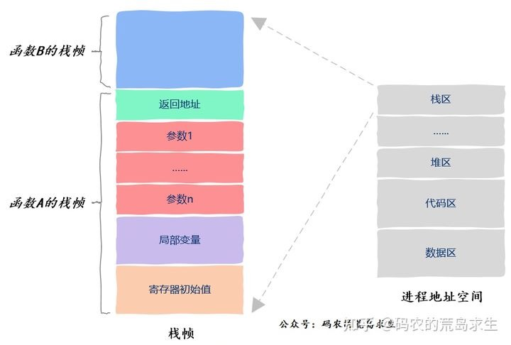

#上下文切换

##参考链接
https://blog.csdn.net/zhizhengguan/article/details/120893914

###CPU上下文
1. CPU寄存器：是CPU内置的容量小，但是速度极快的内存。
2. 程序计数器：用来存储CPU正在执行的指令位置，或者将要执行的指令位置。
3. 先保存当前CPU任务的上下文，再加载下一个任务的上下文（程序计数器 + CPU寄存器），再跳转到程序计数器指向的指令位置，执行新任务

###CPU任务
常见的有进程、线程，还有硬件发出的中断信号

###系统调用
1. 从用户态陷入内核态，需要用系统调用
2. 比如I/O：open(), read(), write()
3. 一次系统调用会进行两次上下文切换，主要是保存当前进程的指令位置，再执行内核态任务，最后再加之前的指令位置，不涉及到进程的虚拟内存等用户态资源保存。

###进程上下文切换
1. 需要先保存当前进程的用户态资源（虚拟内存，全局变量、栈等），再保存内核态资源（程序计数器、寄存器、堆等）；
    再加载下一个进程的内核态资源，最后还得刷新用户态的资源（虚拟内存、用户栈）。

###线程上下文切换
1. 线程是调度的基本单位，进程是资源拥有的基本单位。内核中的任务调度，对象是线程，进程给进程提供了虚拟内存，全局变量等资源。
2. 线程切换分两种：同一个进程内的线程切换：不需要切换进程中的共享资源（虚拟内存，全局变量、堆、文件），需要切换线程自己独有的栈、寄存器、程序计数器。
3. 

###中断上下文切换
1. 中断上下文切换只会影响当前运行的进程的内核态资源（堆、程序计数器、寄存器），不会影响用户态资源（虚拟内存，栈、全局变量），所以只要保存当前进程的
    内核空间状态就行。
2. 对于同一个CPU，中断上下文切换优先级比进程高。